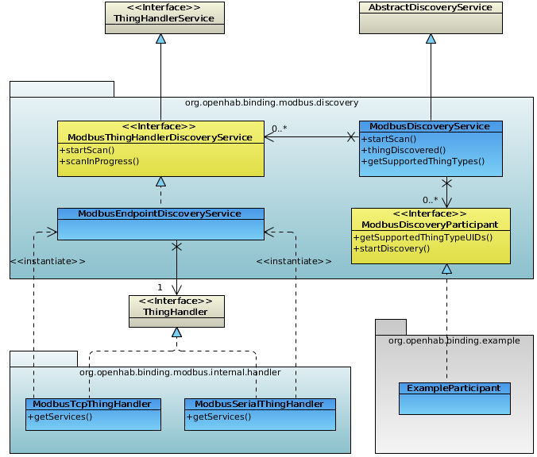
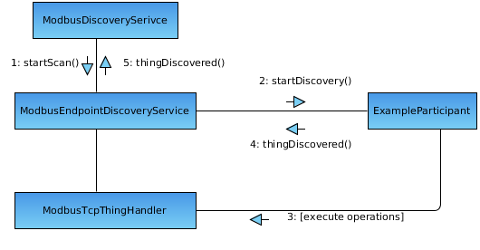

# For Developers

## Testing Serial Implementation

You can use test serial slaves without any hardware on linux using these steps:

1. Set-up virtual null modem emulator using [tty0tty](https://github.com/freemed/tty0tty)
2. Download [diagslave](http://www.modbusdriver.com/diagslave.html) and start modbus serial slave up using this command:

```
./diagslave -m rtu -a 1 -b 38400 -d 8 -s 1 -p none -4 10 /dev/pts/7
```

3. Modify `start.sh` or `start_debug.sh` to include the unconventional port name by adding the following argument to `java`:

```
-Dgnu.io.rxtx.SerialPorts=/dev/pts/8
```

Naturally this is not the same thing as the real thing but helps to identify simple issues.

## Testing TCP Implementation

1. Download [diagslave](http://www.modbusdriver.com/diagslave.html) and start modbus tcp server (slave) using this command:

```
./diagslave -m tcp -a 1 -p 55502
```


## Writing Data

See this [community post](https://community.openhab.org/t/something-is-rounding-my-float-values-in-sitemap/13704/32?u=ssalonen) explaining how `pollmb` and `diagslave` can be used to debug modbus communication.

You can also use `modpoll` to write data:


```bash
# write value=5 to holding register 40001 (index=0 in the binding)
./modpoll -m tcp -a 1 -r 1 -t4 -p 502 127.0.0.1 5
# set coil 00001 (index=0 in the binding) to TRUE
./modpoll -m tcp -a 1 -r 1 -t0 -p 502 127.0.0.1 1
# write float32
./modpoll -m tcp -a 1 -r 1 -t4:float -p 502 127.0.0.1 3.14
```

## Extending Modbus binding

This Modbus binding can be extended by other OSGi bundles to add more specific support for Modbus enabled devices. To do so to you have to create a new OSGi bundle which has the same binding id as this binding. The best way is to use the `ModbusBindingConstants.BINDING_ID` constant.

You'll have to create one or more handler classes for the devices you want to support. For the modbus connection setup and handling you can use the Modbus TCP Slave or Modbus Serial Slave handlers. Your handler should use these handlers as bridges and you can set up your regular or one shot modbus requests to read from the slave. This is done by by creating a `BasicPollTaskImpl` and submitting it using the `ModbusManager` `submitOneTimePoll` and `registerRegularPoll` methods.

Please keep in mind that these reads are asynchronous and they will call your callback once the read is done.

Once you have your data read from the modbus device you can parse and transform them then update your channels to publish these data to the openHAB system.

### Discovery

If you write a device specific handler then adding discovery for this device is very welcome. You will have to write a discovery participant class which implements the `ModbusDiscoveryParticipant` interface and registers itself as a component. Example:

```java

@Component(immediate = true)
@NonNullByDefault
public class SunspecDiscoveryParticipant implements ModbusDiscoveryParticipant {
...
}
```

There are two methods you have to implement:

 - `getSupportedThingTypeUIDs` should return a list of the thing type UIDs that are supported by this discovery participant. This is fairly straightforward.
 
 - `startDiscovery` method will be called when a discovery process has began. This method receives two parameters:
 
    - `ModbusEndpointThingHandler` is the endpoint's handler that should be tested if it is known by your bundle. You can start your read requests against this handler.
    
    - `ModbusDiscoveryListener` this listener instance should be used to report any known devices found and to notify the main discovery process when your binding has finished the discovery.
    
Please try to avoid write requests to the endpoint because it could be some unknown device that write requests could misconfigure.

When a known device is found a `DiscoveryResult` object has to be created then the `thingDiscovered` method has to be called. The `DiscoveryResult` supports properties, and you should use this to store any data that will be useful when the actual thing will be created. For example you could store the start Modbus address of the device or vendor/model informations.

When the discovery process is finished either by detecting a device or by realizing it is not supported you should call the `discoveryFinished` method. This will tear down any resources allocated for the discovery process.


### Discovery Architecture

The following diagram shows the concept how discovery is implemented in this binding. (Note that some intermediate classes and interfaces are not shown for clarity.)



As stated above the discovery process can be extended by OSGi bundles. For this they have to define their own `ModbusDisvoceryParticipant` that gets registered at the `ModbusDiscoveryService`. This object also keeps track of any of the Modbus handlers. Handler level discovery logic is implemented in the `ModbusEndpointDiscoveryService` which gets instantiated for each Modbus `BridgeHandler`.

The communication flow is detailed in the diagram below:



As can be seen the process is initiated by the `ModbusDiscoveryService` which calls each of the `ModbusEndpointDiscoveryService` instances to start the discovery on the available participants. Then a reference to the `ThingHandler` is passed to each of the participants who can use this to do the actual discovery.

Any things discovered are reported back in this chain and ultimately sent to openHAB core.
